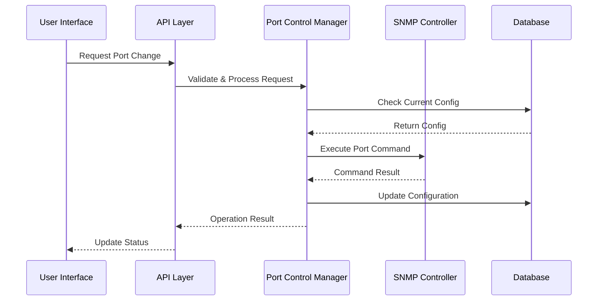

# NetDisco-Rust Design Document

## Overview

NetDisco-Rust is a network discovery and management tool implemented in Rust, providing a modern web interface for network device management. This document outlines the current implementation, architecture, and design decisions.

## Architecture

The application follows a three-tier architecture:

1. **Frontend**: React-based web interface
2. **Backend**: Rust API server
3. **Database**: PostgreSQL for persistent storage

### Component Diagram

```
┌─────────────┐     ┌─────────────┐     ┌─────────────┐
│   Frontend  │     │   Backend   │     │  Database   │
│  (React)    │◄───►│  (Rust)     │◄───►│ (PostgreSQL)│
└─────────────┘     └─────────────┘     └─────────────┘
```

## Components

### 1. Frontend (React + TypeScript)

#### Structure
- Built with Vite + React
- Material-UI for components
- React Router for navigation
- Axios for API communication

#### Key Pages
- Dashboard
- Devices List
- Device Details
- Interfaces
- VLANs
- Settings

#### State Management
- React hooks for local state
- API service layer for data fetching

### 2. Backend (Rust)

#### Core Components
- API Server (Axum)
- Network Discovery
- Database Layer
- SNMP Scanner

#### Key Modules
- `src/api/`: REST API endpoints
- `src/db/`: Database operations
- `src/discovery/`: Network discovery
- `src/models/`: Data models

### 3. Database (PostgreSQL)

#### Schema
- Devices table
- Interfaces table
- VLANs table

## Data Models

### Device
```rust
pub struct Device {
    pub id: Option<i64>,
    pub ip: IpAddr,
    pub hostname: Option<String>,
    pub sysname: Option<String>,
    pub sysdesc: Option<String>,
    pub location: Option<String>,
    pub contact: Option<String>,
    pub vendor: Option<String>,
    pub model: Option<String>,
    pub os: Option<String>,
    pub os_version: Option<String>,
    pub serial: Option<String>,
    pub uptime: Option<i64>,
    pub last_discovered: Option<DateTime<Utc>>,
    pub snmp_community: Option<String>,
    pub snmp_version: Option<String>,
    pub status: DeviceStatus,
    pub device_type: DeviceType,
}
```

### Device Status
```rust
pub enum DeviceStatus {
    Active,
    Down,
    Retired,
    Unknown,
}
```

### Device Type
```rust
pub enum DeviceType {
    Router,
    Switch,
    Firewall,
    AccessPoint,
    Host,
    Printer,
    Storage,
    Unknown,
}
```

## API Endpoints

### Devices
- `GET /api/devices`: List all devices
- `GET /api/devices/:id`: Get device details
- `POST /api/devices`: Create new device
- `PUT /api/devices/:id`: Update device
- `DELETE /api/devices/:id`: Delete device

### Interfaces
- `GET /api/devices/:device_id/interfaces`: List device interfaces
- `GET /api/interfaces/:id`: Get interface details
- `POST /api/interfaces`: Create interface
- `PUT /api/interfaces/:id`: Update interface
- `DELETE /api/interfaces/:id`: Delete interface

### VLANs
- `GET /api/devices/:device_id/vlans`: List device VLANs
- `GET /api/vlans/:id`: Get VLAN details
- `POST /api/vlans`: Create VLAN
- `PUT /api/vlans/:id`: Update VLAN
- `DELETE /api/vlans/:id`: Delete VLAN

## Database Schema

### Devices Table
```sql
CREATE TABLE devices (
    id BIGSERIAL PRIMARY KEY,
    ip TEXT NOT NULL UNIQUE,
    hostname TEXT,
    sysname TEXT,
    sysdesc TEXT,
    location TEXT,
    contact TEXT,
    vendor TEXT,
    model TEXT,
    os TEXT,
    os_version TEXT,
    serial TEXT,
    uptime BIGINT,
    last_discovered TIMESTAMPTZ,
    snmp_community TEXT,
    snmp_version TEXT,
    status TEXT NOT NULL DEFAULT 'Unknown',
    device_type TEXT NOT NULL DEFAULT 'Unknown',
    created_at TIMESTAMPTZ NOT NULL DEFAULT NOW(),
    updated_at TIMESTAMPTZ NOT NULL DEFAULT NOW()
);
```

## Network Discovery

### SNMP Scanner
- Implements SNMP v2c
- Scans for devices using community string
- Collects basic device information
- Supports concurrent scanning

### Discovery Process
1. Initialize SNMP scanner with configuration
2. Scan single IP or network range
3. Parse SNMP responses
4. Store discovered devices in database

## Configuration

### Environment Variables
- `DATABASE_URL`: PostgreSQL connection string
- `SNMP_COMMUNITY`: SNMP community string
- `SNMP_VERSION`: SNMP version (2c)
- `SNMP_TIMEOUT`: SNMP timeout in seconds
- `SNMP_RETRIES`: Number of SNMP retries
- `CONCURRENT_SCANS`: Number of concurrent scans

## Feature Specifications

### MAC Address Tracking and Port Mapping

#### Description
MAC address tracking and port mapping functionality enables the system to discover, track, and map MAC addresses to their physical switch ports. This feature is essential for network troubleshooting, security monitoring, and asset tracking.

#### Technical Requirements
- [ ] SNMP support for MAC address table queries
- [ ] Database schema for MAC address storage
- [ ] Real-time MAC address tracking
- [ ] Historical MAC address data
- [ ] Port mapping visualization
- [ ] MAC address search functionality
- [ ] API endpoints for MAC address queries

#### Architecture Changes

##### New Components
1. **MAC Address Collector**
   - SNMP-based MAC address table collection
   - Support for multiple vendor MIBs
   - Periodic refresh mechanism
   - Change detection and notification

2. **MAC Address Database**
   - New tables for MAC address storage
   - Historical data tracking
   - Port mapping relationships
   - Indexing for efficient queries

3. **MAC Address API**
   - REST endpoints for MAC address queries
   - Real-time status updates
   - Historical data access
   - Search functionality

##### Modified Components
1. **Discovery Engine**
   - Integration with MAC address collection
   - Enhanced device information
   - Port status tracking

2. **Database Module**
   - New schema for MAC address data
   - Migration scripts
   - Data retention policies

#### Database Updates

```sql
-- MAC Address Table
CREATE TABLE mac_addresses (
    id SERIAL PRIMARY KEY,
    mac_address MACADDR NOT NULL,
    device_id INTEGER REFERENCES devices(id),
    port_id INTEGER REFERENCES ports(id),
    vlan_id INTEGER,
    first_seen TIMESTAMP WITH TIME ZONE NOT NULL,
    last_seen TIMESTAMP WITH TIME ZONE NOT NULL,
    created_at TIMESTAMP WITH TIME ZONE DEFAULT CURRENT_TIMESTAMP,
    updated_at TIMESTAMP WITH TIME ZONE DEFAULT CURRENT_TIMESTAMP,
    UNIQUE(mac_address, device_id, port_id)
);

-- Port Table (Enhanced)
CREATE TABLE ports (
    id SERIAL PRIMARY KEY,
    device_id INTEGER REFERENCES devices(id),
    if_index INTEGER NOT NULL,
    name VARCHAR(255),
    description TEXT,
    status VARCHAR(50),
    speed BIGINT,
    duplex VARCHAR(50),
    vlan_id INTEGER,
    created_at TIMESTAMP WITH TIME ZONE DEFAULT CURRENT_TIMESTAMP,
    updated_at TIMESTAMP WITH TIME ZONE DEFAULT CURRENT_TIMESTAMP,
    UNIQUE(device_id, if_index)
);

-- MAC Address History Table
CREATE TABLE mac_address_history (
    id SERIAL PRIMARY KEY,
    mac_address_id INTEGER REFERENCES mac_addresses(id),
    device_id INTEGER REFERENCES devices(id),
    port_id INTEGER REFERENCES ports(id),
    vlan_id INTEGER,
    seen_at TIMESTAMP WITH TIME ZONE NOT NULL,
    created_at TIMESTAMP WITH TIME ZONE DEFAULT CURRENT_TIMESTAMP
);
```

#### API Endpoints

1. **MAC Address Queries**
   - `GET /api/mac-addresses`: List all MAC addresses
   - `GET /api/mac-addresses/{mac}`: Get specific MAC address details
   - `GET /api/mac-addresses/search`: Search MAC addresses
   - `GET /api/mac-addresses/history/{mac}`: Get MAC address history

2. **Port Mapping**
   - `GET /api/ports/{port_id}/mac-addresses`: Get MAC addresses on a port
   - `GET /api/devices/{device_id}/mac-addresses`: Get MAC addresses on a device
   - `GET /api/vlans/{vlan_id}/mac-addresses`: Get MAC addresses in a VLAN

#### UI/UX Considerations

1. **MAC Address List View**
   - [ ] Table display of MAC addresses
   - [ ] Filtering and sorting options
   - [ ] Quick search functionality
   - [ ] Export capabilities

2. **MAC Address Detail View**
   - [ ] Detailed MAC address information
   - [ ] Port mapping visualization
   - [ ] Historical data timeline
   - [ ] Associated device information

3. **Port Mapping View**
   - [ ] Visual port layout
   - [ ] MAC address assignments
   - [ ] Port status indicators
   - [ ] Quick actions menu

#### Testing Requirements

1. **Unit Tests**
   - [ ] MAC address collection
   - [ ] Database operations
   - [ ] API endpoints
   - [ ] Data validation

2. **Integration Tests**
   - [ ] SNMP communication
   - [ ] Database migrations
   - [ ] API functionality
   - [ ] UI components

3. **Performance Tests**
   - [ ] Large-scale MAC address collection
   - [ ] Database query performance
   - [ ] Real-time updates
   - [ ] Historical data access

#### Implementation Phases

1. **Phase 1: Core Functionality**
   - Database schema implementation
   - Basic MAC address collection
   - Simple API endpoints
   - Basic UI display

2. **Phase 2: Enhanced Features**
   - Historical data tracking
   - Advanced search capabilities
   - Port mapping visualization
   - Real-time updates

3. **Phase 3: Optimization**
   - Performance improvements
   - Advanced filtering
   - Export functionality
   - Integration with other features

## Change Management

### Documentation-First Process

All new features and major changes must be documented in this design document before implementation begins. This ensures proper planning and maintains project consistency.

#### Process Steps

1. **Documentation Phase**
   - Create a new branch for the feature/change
   - Update this design document with:
     - Feature description and goals
     - Technical requirements
     - Architecture changes
     - Database schema updates
     - API endpoint specifications
     - UI/UX considerations
     - Testing requirements
   - Submit PR for documentation review

2. **Implementation Phase**
   - Start only after documentation is approved
   - Follow the documented specifications
   - Update documentation if changes are needed
   - Include tests for new functionality

3. **Review Phase**
   - Code review against documentation
   - Verify all requirements are met
   - Update documentation if needed
   - Merge changes

#### Documentation Template for New Features

```markdown
### [Feature Name]

#### Description
[Detailed description of the feature]

#### Technical Requirements
- [ ] Requirement 1
- [ ] Requirement 2
- [ ] Requirement 3

#### Architecture Changes
- [ ] Component 1 changes
- [ ] Component 2 changes
- [ ] Component 3 changes

#### Database Updates
```sql
-- New tables or schema changes
```

#### API Endpoints
- `[METHOD] /api/endpoint`: [Description]

#### UI/UX Considerations
- [ ] UI component 1
- [ ] UI component 2
- [ ] UX flow changes

#### Testing Requirements
- [ ] Test case 1
- [ ] Test case 2
- [ ] Test case 3
```

#### Version Control

- Branch naming: `feature/[feature-name]` or `change/[change-name]`
- Commit messages should reference documentation
- Documentation updates should be separate commits
- Documentation should be reviewed before implementation starts

#### Example Process

1. Create feature branch:
   ```bash
   git checkout -b feature/mac-tracking
   ```

2. Update design_doc.md with new feature details

3. Submit PR for documentation review:
   ```bash
   git add docs/design_doc.md
   git commit -m "docs: add MAC tracking feature specification"
   git push origin feature/mac-tracking
   ```

4. After approval, start implementation:
   ```bash
   git checkout feature/mac-tracking
   # Start implementation
   ```

5. Update documentation as needed during implementation

## Current Limitations

1. **Network Discovery**
   - Limited to SNMP v2c
   - Basic device information only
   - No MAC address tracking
   - No port mapping

2. **Device Management**
   - No switch port control
   - No VLAN management
   - No PoE control

3. **User Interface**
   - Basic device listing
   - No network visualization
   - Limited device details

4. **Configuration**
   - Hardcoded values
   - No configuration file support
   - Limited environment variables

## Future Enhancements

1. **Network Discovery**
   - Add MAC address tracking
   - Implement port mapping
   - Support multiple SNMP versions
   - Add CLI device support

2. **Device Management**
   - Add switch port control
   - Implement VLAN management
   - Add PoE control
   - Support multiple device types

3. **User Interface**
   - Add network visualization
   - Enhance device details
   - Add real-time updates
   - Implement user authentication

4. **Configuration**
   - Add YAML configuration
   - Support multiple environments
   - Add configuration validation
   - Implement secrets management

## Switch Port Control Feature

### Overview
The Switch Port Control feature enables network administrators to manage and configure switch ports through a unified interface. This includes basic port operations (enable/disable), configuration management (speed, duplex), VLAN assignments, and advanced features like PoE control and port security.

### Architecture

#### Components
1. Port Control Manager
   - Handles port operations and configuration
   - Manages state transitions
   - Validates configuration changes
   - Implements retry and rollback mechanisms

2. SNMP Controller
   - Executes SNMP commands for port management
   - Handles vendor-specific implementations
   - Provides error handling and recovery

3. Port Configuration Store
   - Maintains port configuration state
   - Tracks configuration history
   - Handles configuration validation

4. Security Manager
   - Manages port security features
   - Handles access control lists
   - Monitors security violations

#### Data Flow


### Database Schema

```sql
-- Port Configuration Table
CREATE TABLE port_configurations (
    id SERIAL PRIMARY KEY,
    port_id TEXT NOT NULL,
    admin_status BOOLEAN NOT NULL DEFAULT true,
    speed INTEGER,
    duplex TEXT CHECK (duplex IN ('full', 'half', 'auto')),
    description TEXT,
    vlan_id INTEGER,
    poe_enabled BOOLEAN,
    poe_power_limit INTEGER,
    created_at TIMESTAMPTZ NOT NULL DEFAULT NOW(),
    updated_at TIMESTAMPTZ NOT NULL DEFAULT NOW()
);

-- Port Security Configuration
CREATE TABLE port_security_configs (
    id SERIAL PRIMARY KEY,
    port_id TEXT NOT NULL,
    security_enabled BOOLEAN NOT NULL DEFAULT false,
    max_mac_addresses INTEGER,
    violation_action TEXT CHECK (violation_action IN ('shutdown', 'restrict', 'protect')),
    sticky_mac_enabled BOOLEAN DEFAULT false,
    created_at TIMESTAMPTZ NOT NULL DEFAULT NOW(),
    updated_at TIMESTAMPTZ NOT NULL DEFAULT NOW()
);

-- Port Configuration History
CREATE TABLE port_config_history (
    id SERIAL PRIMARY KEY,
    port_id TEXT NOT NULL,
    change_type TEXT NOT NULL,
    old_value JSONB,
    new_value JSONB,
    changed_by TEXT NOT NULL,
    changed_at TIMESTAMPTZ NOT NULL DEFAULT NOW()
);

-- Port Mirroring Configuration
CREATE TABLE port_mirror_configs (
    id SERIAL PRIMARY KEY,
    source_port_id TEXT NOT NULL,
    destination_port_id TEXT NOT NULL,
    direction TEXT CHECK (direction IN ('ingress', 'egress', 'both')),
    enabled BOOLEAN NOT NULL DEFAULT true,
    created_at TIMESTAMPTZ NOT NULL DEFAULT NOW(),
    updated_at TIMESTAMPTZ NOT NULL DEFAULT NOW()
);
```

### API Endpoints

#### Port Management
```
GET /api/ports
GET /api/ports/{port_id}
PATCH /api/ports/{port_id}
GET /api/ports/{port_id}/status
GET /api/ports/{port_id}/statistics
```

#### Port Configuration
```
GET /api/ports/{port_id}/config
PUT /api/ports/{port_id}/config
GET /api/ports/{port_id}/config/history
POST /api/ports/{port_id}/enable
POST /api/ports/{port_id}/disable
```

#### VLAN Management
```
GET /api/ports/{port_id}/vlans
PUT /api/ports/{port_id}/vlans
DELETE /api/ports/{port_id}/vlans/{vlan_id}
```

#### PoE Control
```
GET /api/ports/{port_id}/poe
PUT /api/ports/{port_id}/poe
GET /api/ports/{port_id}/poe/status
```

#### Port Security
```
GET /api/ports/{port_id}/security
PUT /api/ports/{port_id}/security
GET /api/ports/{port_id}/security/violations
POST /api/ports/{port_id}/security/reset
```

#### Port Mirroring
```
GET /api/ports/{port_id}/mirror
PUT /api/ports/{port_id}/mirror
DELETE /api/ports/{port_id}/mirror
```

### Frontend Components

1. PortControlPanel
   - Main interface for port management
   - Displays port status and configuration
   - Provides quick actions (enable/disable)

2. PortConfigurationForm
   - Detailed port configuration interface
   - Speed and duplex settings
   - VLAN assignment
   - Description management

3. PoEManagementPanel
   - PoE status display
   - Power consumption monitoring
   - Power limit configuration

4. PortSecuritySettings
   - Security policy configuration
   - MAC address limits
   - Violation actions
   - Sticky MAC configuration

5. PortMirroringConfig
   - Source and destination port selection
   - Traffic direction configuration
   - Mirroring session management

### Implementation Phases

1. Phase 1: Basic Port Control
   - Port enable/disable functionality
   - Basic port configuration (speed, duplex)
   - Port status monitoring
   - Core UI components

2. Phase 2: VLAN and PoE
   - VLAN assignment interface
   - PoE monitoring and control
   - Power management features
   - Extended UI components

3. Phase 3: Security Features
   - Port security implementation
   - MAC address limiting
   - Violation handling
   - Security monitoring UI

4. Phase 4: Advanced Features
   - Port mirroring
   - Configuration history
   - Batch operations
   - Advanced monitoring

### Error Handling

1. Configuration Validation
   - Pre-validation of all configuration changes
   - Vendor-specific constraint checking
   - Dependency validation

2. Operation Recovery
   - Automatic retry for failed operations
   - Configuration rollback capability
   - State recovery mechanisms

3. Error Reporting
   - Detailed error messages
   - Operation audit trail
   - User notifications

### Testing Strategy

1. Unit Tests
   - Port control manager functions
   - Configuration validation
   - Security policy enforcement

2. Integration Tests
   - SNMP command execution
   - Database operations
   - API endpoint functionality

3. End-to-End Tests
   - Complete port configuration workflow
   - Error handling scenarios
   - UI component interaction

### Security Considerations

1. Access Control
   - Role-based access to port control features
   - Audit logging of all changes
   - Configuration change approval workflow

2. Validation
   - Input sanitization
   - Configuration validation
   - Rate limiting of operations

3. Monitoring
   - Security violation tracking
   - Configuration change alerts
   - Unauthorized access attempts

### Current Limitations

1. Vendor Support
   - Limited to SNMP-capable devices
   - Vendor-specific feature availability
   - Command compatibility issues

2. Performance
   - SNMP operation latency
   - Bulk operation limitations
   - Real-time status update constraints

3. Security
   - SNMP protocol limitations
   - Authentication mechanism constraints
   - Audit trail storage limits

### Future Enhancements

1. Advanced Features
   - Scheduled port operations
   - Configuration templates
   - Bulk configuration tools

2. Integration
   - Network monitoring system integration
   - Configuration backup integration
   - Change management system integration

3. Automation
   - Port configuration automation
   - Security policy automation
   - Maintenance automation 